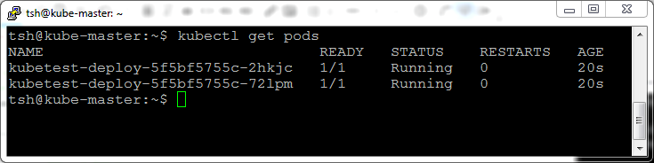
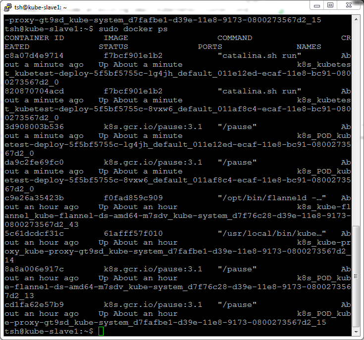

##### Thomas Schwade - November 20, 2018

## Running Natural Ajax in a Kubernetes Cluster

### Why Kubernetes?

In a [previous article](https://github.com/zerodrive/NJX-Docker) I have shown how a Natural Ajax web application can be packaged and deployed in a Docker container. The logical next step to leverage this approach is running the application in a Kubernetes cluster. Why? The answer is **scalability**. In an application based on Natural Ajax, Natural and Adabas it is rarely the Natural and Adabas backend that forms the performance bottleneck. More often it is either the browser frontend or the web frontend application. A Kubernetes cluster allows adding and removing instances of the web frontend application as needed and makes that part of the application arbitrarily scalable. 

### Setting up a Kubernetes cluster

In order to use Kubernetes it is not necessary to run the application in a private cloud or even under a public cloud provider like AWS, Azure or GCE. Setting up a local Kubernetes cluster on "bare metal" or on a set of Linux virtual machines is more instructive and forms a lower hurdle for many organizations. 

For this example I assume that we have already set up a small Kubernetes cluster consisting of one master node and one slave node. Additionally, we have set up a private Docker registry from which the cluster loads the Docker images. In one of the next postings I am going to describe step by step how this infrastructure was set up.

### Verifying the master node and the slave node

First we have a look on the master node and check the cluster is up and running:

We see that currently no service except the Kubernetes service itself is installed.

Then we check the available nodes. Nodes are the physical or virtual machines that form the cluster. We can join any number of slave nodes to the cluster. The Kubernetes master automatically distributes the load to the available nodes.

Both the master node and the slave node are available.

Next we check the available pods. Pods are the instances of a deployment in a Kubernetes cluster. A pod represents a set of running containers on the cluster. In our example we are going to create a deployment that consists of a pod with just one Docker container: a Natural Ajax web application.

Of course no pods are running yet. This is because we have not yet created a deployment. But this is not the whole truth: A number of pods that form the Kubernetes infrastructure are already running. We see them with the command

	kubectl get pods --all-namespaces

Finally we check the available deployments.

Now we have a look at the slave node. We see a number of docker containers that form the Kubernetes infratructure of the slave node.

### Creating a deployment

Now we want to deploy our Natural Ajax web application to the cluster. The first thing we need to do is packing the application .war file into a Docker image. I have described in an [earlier post](https://github.com/zerodrive/NJX-Docker) how this is done. It is important to note that Kubernetes needs to load a container image from a Docker registry. It is not possible to load local images. For this example I assume that we have uploaded the Docker image of our Natural Ajax web application with the name kubetest:v1 into a private Docker registry on kube-master on port 443.

In order to create a deployment, we need a deployment descriptor. This is a .yaml file that describes the images that we want to combine to a pod and deploy. Our deployment will contain only one image: The Natural Ajax web application.

Contents of kubetest-deploy.yaml:

	apiVersion: apps/v1
	kind: Deployment
	metadata:
  		name: kubetest-deploy
	spec:
  		selector:
    		matchLabels:
      			app: kubetest
  		replicas: 2
  		template:
    		metadata:
      			labels:
        			app: kubetest
    		spec:
      			containers:
      			- name: kubetest
        		  image: kube-master:443/kubetest:v1
        		  ports:
        		- containerPort: 8080

The most important fields in this specification are:

- metadata, where we give the deployment an identifying name
- replicas, where we specify how many instances of the deployment (pods) we want to run
- containers, where we specify the images to be loaded, the registry to load them from and the ports through which they provide their services.

Later, when we create a service specification, we will refer to the label specifications, to identify one or several deployments that will form a service.

Now we can apply our deployment to the Kubernetes cluster.

And we check if it is available and notice that the two requested replicas have been created.

We can check this in more detail and list the running pods.

Now we check how this looks at the slave node. We see two new Docker containers running catalina.sh. These are the Tomcat instances that run our Natural Ajax web application. And there a two new "/pause" containers. Kubernetes adds this container to every pod. It is responsible for the network communication between pods.

To see how this scales, let us add one more replica to the deployment. we just change 

  		replicas: 2
into

  		replicas: 3

in our deployment descriptor kubetest-deploy.yaml and apply it again.

We check the number of pods:

And on the slave we see the additional running "catalina.sh" and "/pause" container.

### Creating a service

In order to make our deployment available to the outside world, we need to wrap it into a service. For our simple example this might seem overengineered, but note that in practice an application will consist of many deployments, where most of them communicate only internally and only a few expose their services to clients.

We create a service descriptor kubetest-service.yaml:

	apiVersion: v1
	kind: Service
	metadata:
  		name: kubetest-service
	spec:
  		type: NodePort
  		sessionAffinity: ClientIP
  		externalTrafficPolicy: Local
  		selector:
   			app: kubetest
  		ports:
  		- protocol: TCP
    	  port: 8080
    	  targetPort: 8080

The service type NodePort is only one of the available options to create a service. It expoases a port of the deployment available to the outside under a specific port number on any slave node in the cluster. The service will dispatch requests to this port evenly to all available replicas of the deployment.

Our Natural Ajax web application has special requirements. We need the parameter **sessionAffinity: ClientIP** to make sure that a session that was opened on a given pod stays on that pod. We also need **externalTrafficPolicy: Local**, to make sure that a session started on a given node is not dispatched to a pod on another node. This is necessary due to the simple model of IP address translation used in the NodePort service type. We would need to use the service type LoadBalancer to overcome this restriction.

Now we can create our service.

And list the available services.

The command **describe service** gives detailed insight in how to use the service. The **NodePort 32698** is the port under which we can reach the service on each slave node. The requests wil be evenly dispatched to the three replicas of our deployment (pod) that are listed under **Endpoints**.

### Testing the service

Let us give it a try:

	http://kube-slave1:32698/kubetest/start.html

And the simple page of the kubetest application displays the connection and session data of our request. 

Our service specification makes sure that client requests are evenly distributed to the three pods. But each individual client session, once started, remains tied to the pod on whichit was initiated.

### Summary and outlook

We have seen how we can deploy our Natural Ajax web application to a Kubernetes cluster and how we can respond to an increasing number of client requests by simply adding new replicas of our deployment.

Kubernetes offers many more advantages, such as "rolling update", which allows rolling out new releases of our application without interfering with running sessions.

In our example we used the service type NodePort to expose our deployment as a service. We needed to specify **externalTrafficPolicy: Local**, to make sure that a session started on a given node is not dispatched to another node. This was due to the session oriented nature of a Natural Ajax web application and the IP address translation technique used by the NodePort service type.

To overcome this restriction and to support the service on a real cluster with multiple nodes (not just multiple pods), we would have to use the service type LoadBalancer and run the cluster on a cloud infrastructure with load balancer support, or by installing a load balancer solution in our local cluster environment (for instance HAProxy). But this is beyond the scope of this article.

 